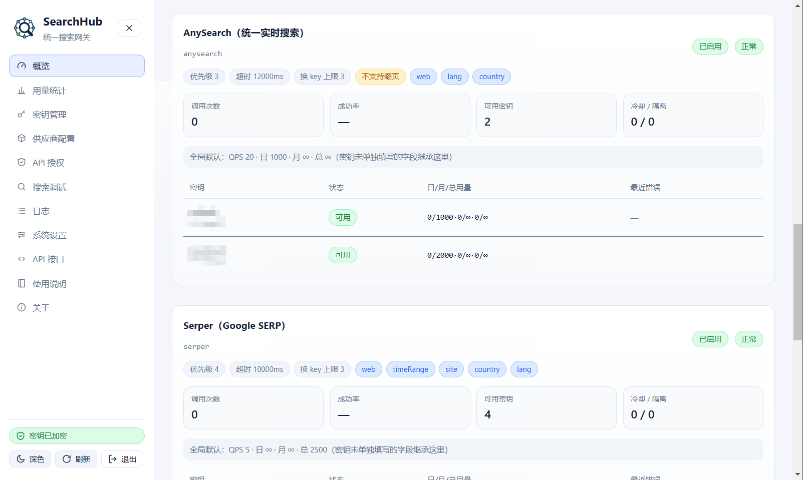
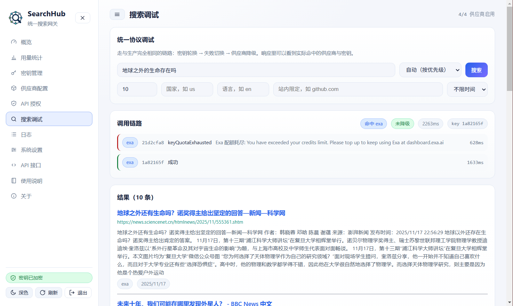
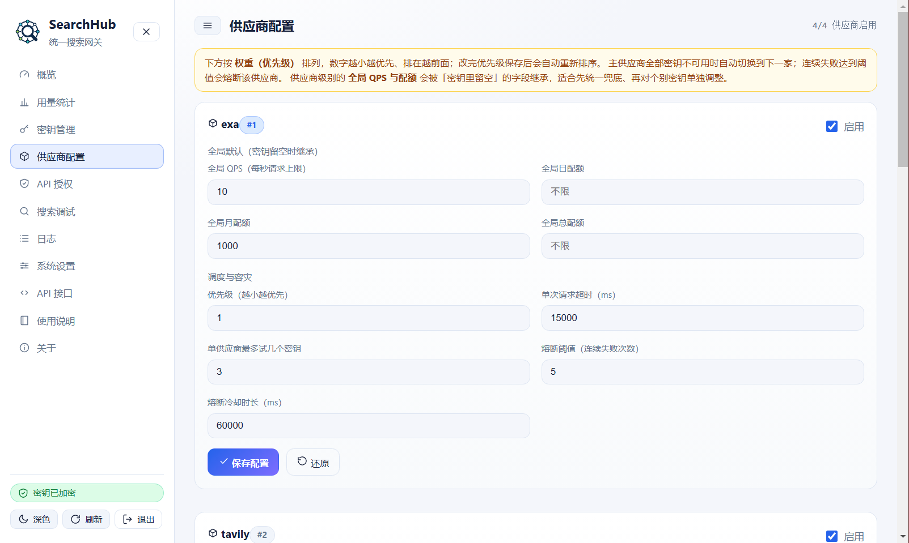
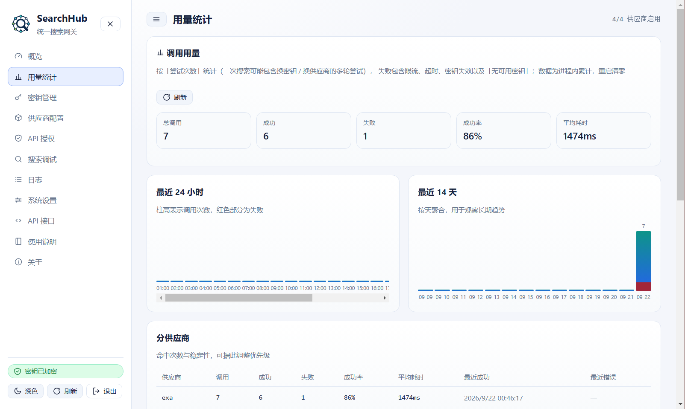
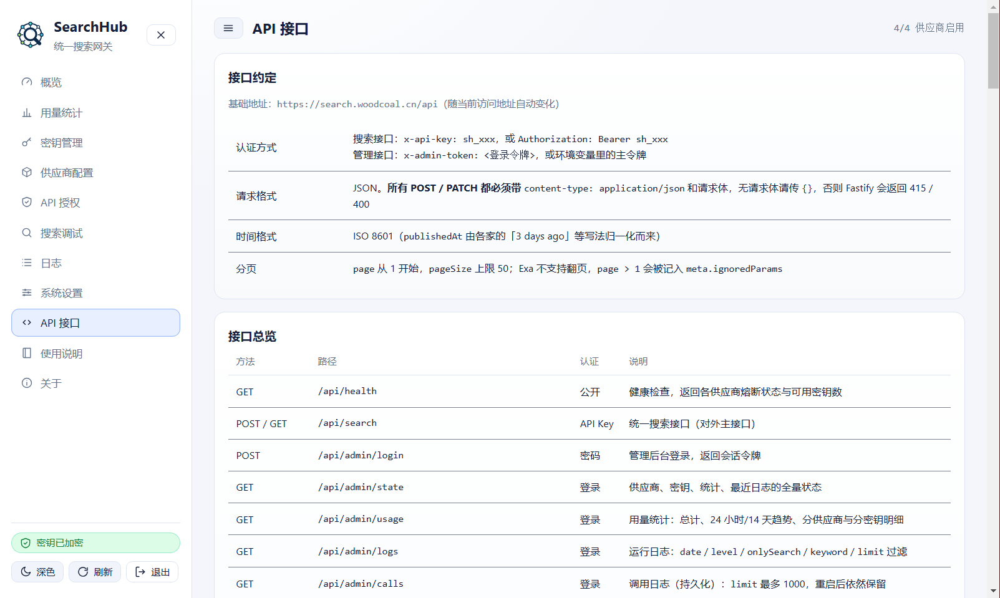

# SearchHub

[中文 README](./README.md) · [npm](https://www.npmjs.com/package/searchhub) · [Issues](https://github.com/woodcoal/SearchHub/issues)

[](https://www.npmjs.com/package/searchhub)
[](./LICENSE)
[](https://nodejs.org)
[](https://github.com/woodcoal/SearchHub/actions/workflows/ci.yml)

> Self-hosted resilient search gateway for AI agents.
>
> **One protocol. Multiple search providers. Automatic key rotation and failover.**

SearchHub normalizes Serper, Tavily, Exa, AnySearch, and other search APIs behind one HTTP, CLI, and MCP interface. It manages provider keys, quotas, rate limits, circuit breakers, logs, and failover so an AI agent does not lose web search when one key or provider fails.

It is built for **MCP clients, AI agents, RAG applications, and self-hosted automation services**.

## Why SearchHub?

A single search provider is a single point of failure. SearchHub handles the operational layer around search APIs:

- Rotate to the next key when a key is invalid or rate-limited
- Fail over to another provider when an upstream service is unavailable
- Open a circuit after repeated failures and probe again after cooldown
- Configure per-key QPS, daily, monthly, and total quotas
- Expose one normalized HTTP API, CLI, MCP server, and admin UI
- Self-host the gateway so provider keys and call logs stay on your infrastructure

## Screenshots

> The admin UI is currently **Chinese only** — an English UI is not implemented yet. The screenshots below are therefore in Chinese.

**Overview** — one card per provider: breaker state, number of usable keys, cooling / quarantined counts, capability tags, and the provider-level default quotas.



**Search playground** — a real call. The first Exa key came back with its quota exhausted (`keyQuotaExhausted`), so the gateway switched to a second key and the request succeeded. The call chain records both attempts, showing which provider was hit, which key was used, and whether the result was degraded.



**Provider configuration** — providers are ordered by priority. Global QPS and three-tier quotas act as a fallback that individual keys inherit when left blank; timeout, max key attempts per provider, breaker threshold and cooldown are all configurable.



**Usage statistics** — aggregated by attempt, with 24-hour and 14-day trends, plus per-provider and per-key success rate, average latency and last error.



**API reference** — built-in documentation covering authentication, request format, and where providers differ (for example on pagination).



## Quick start

### npm

Requires **Node.js >= 22** (24 recommended, Active LTS).

```bash
npm install -g searchhub

export SEARCHHUB_SECRET=$(node -e "console.log(require('crypto').randomBytes(32).toString('hex'))")
export SEARCHHUB_ADMIN_PASSWORD=$(node -e "console.log(require('crypto').randomBytes(12).toString('base64url'))")
searchhub start
```

Open <http://localhost:8787> and sign in with `SEARCHHUB_ADMIN_PASSWORD`.

> These two values protect your **upstream provider keys** and your **admin login**. The `change-me` placeholders in older examples are not safe defaults — using them makes key encryption pointless.
> `SEARCHHUB_SECRET` is the master key used to decrypt stored provider keys. **Set it once and never change it** — changing it makes already-stored keys undecryptable.

For a quick trial:

```bash
npx searchhub start
```

### Docker Compose

```bash
curl -O https://raw.githubusercontent.com/woodcoal/SearchHub/main/docker-compose.yml

cat > .env <<EOF
SEARCHHUB_SECRET=$(node -e "console.log(require('crypto').randomBytes(32).toString('hex'))")
SEARCHHUB_ADMIN_PASSWORD=$(node -e "console.log(require('crypto').randomBytes(12).toString('base64url'))")
# Optional provider key seeding:
# SERPER_KEYS=...
# TAVILY_KEYS=...
# EXA_KEYS=...
# ANYSEARCH_KEYS=...
EOF

docker compose up -d --build
```

Open <http://localhost:8787>. Data and logs are persisted in the `searchhub-data` Docker volume.

> Note the heredoc uses `<<EOF` **without** quotes — that is what lets the shell expand `$(...)`. Node is used for generation because it is already a prerequisite of this project and behaves identically across platforms.

Do not commit `.env`. In production, use your platform's secret manager for passwords and provider keys.

## First configuration

1. Sign in to the admin UI.
2. Add Serper, Tavily, Exa, or AnySearch provider keys.
3. Open **API Authorization** and create a caller API key.
4. Run a search from the playground or CLI.

```bash
searchhub keys add serper '<provider-key>' --label primary --qps 2
searchhub keys add tavily '<provider-key>' --label backup --monthly-quota 1000
searchhub apikey create my-agent
searchhub search "latest MCP servers" --size 5
```

Provider keys and SearchHub caller API keys are separate credentials: the former access upstream providers; the latter protect your SearchHub API.

## MCP

### Local stdio

For Claude Desktop, Cursor, Cline, and other clients that launch local MCP servers:

```json
{
  "mcpServers": {
    "searchhub": {
      "command": "searchhub",
      "args": ["mcp"]
    }
  }
}
```

The CLI reads `.env` from the current directory and the process environment. To use another data directory:

```json
{
  "mcpServers": {
    "searchhub": {
      "command": "searchhub",
      "args": ["mcp", "--home", "/path/to/searchhub-data"]
    }
  }
}
```

### Streamable HTTP

The main service exposes `/mcp` on the same port:

```json
{
  "mcpServers": {
    "searchhub": {
      "url": "http://your-host:8787/mcp",
      "headers": {
        "x-api-key": "sh_xxxxxxxxxx"
      }
    }
  }
}
```

You can also run a standalone MCP HTTP endpoint:

```bash
searchhub mcp --http --port 8788
```

Built-in tools:

| Tool | Purpose |
|---|---|
| `searchhub_search` | Run a normalized web search |
| `searchhub_status` | Inspect provider health, breaker state, and key counts |
| `searchhub_providers` | List providers and their capabilities |

## HTTP API

The health endpoint is public:

```bash
curl http://localhost:8787/api/health
```

Search requests require a caller API key created in the admin UI, or `SEARCHHUB_API_TOKEN`:

```bash
curl -X POST http://localhost:8787/api/search \
  -H 'content-type: application/json' \
  -H 'x-api-key: sh_xxxxxxxxxx' \
  -d '{"q":"MCP server","pageSize":10,"timeRange":"week","site":"github.com"}'
```

The normalized response includes provider and failover metadata:

```json
{
  "query": { "q": "MCP server", "pageSize": 10 },
  "results": [
    { "title": "...", "url": "https://...", "snippet": "...", "provider": "serper" }
  ],
  "meta": {
    "provider": "serper",
    "tookMs": 842,
    "degraded": false,
    "ignoredParams": [],
    "attempts": [{ "provider": "serper", "ok": true, "tookMs": 842 }]
  }
}
```

`meta.attempts` records the keys and providers tried for the request, which makes failover behavior observable.

## Built-in providers

| ID | Positioning | Main capabilities |
|---|---|---|
| `serper` | Raw Google SERP results | Pagination, time range, site, country, language |
| `tavily` | Real-time search for agents | Time range, site, country, language, safe search |
| `exa` | Neural / semantic search | Time range, site |
| `anysearch` | Unified real-time search | Language, region, anonymous fallback |

Provider response formats and error codes are normalized by adapters. To add a provider, implement an adapter, classify its faults, and register it in `src/providers/index.ts`.

## Resilience and quotas

| Failure | Action |
|---|---|
| Invalid key (401/403) | Quarantine the key and try the next one |
| Rate limit (429) | Respect `Retry-After`, cool down, and try the next key |
| Quota exhausted | Cool down until the next reset period and try the next key |
| Provider outage (5xx/timeout) | Do not punish the key; count breaker failures and switch provider |
| Bad request (400) | Do not retry the same provider with the same request |

Configure per provider and per key:

- QPS
- Daily, monthly, and total quotas
- Provider priority and timeout
- Maximum key attempts per provider
- Breaker threshold and cooldown

## CLI

```bash
searchhub start                         # Start the API and admin UI
searchhub search "openai" --size 5     # Search directly
searchhub status                        # Provider health
searchhub keys list                     # List key status
searchhub keys test serper primary      # Test one key
searchhub usage --json                  # Usage statistics
searchhub logs --prune                  # Prune expired logs
searchhub apikey create my-agent        # Create a caller API key
searchhub mcp                           # Start stdio MCP
searchhub mcp --http --port 8788        # Start HTTP MCP
```

## Data, logs, and security

Default data directory:

```text
~/.search-hub/
├── settings.json
├── store.json
└── log/
    ├── searchhub-YYYY-MM-DD.log
    └── calls.jsonl
```

- Provider keys are encrypted at rest with AES-256-GCM when `SEARCHHUB_SECRET` is configured; otherwise SearchHub warns and stores them without encryption.
- Admin passwords are stored as scrypt hashes.
- Caller API keys are stored as SHA-256 hashes and shown in plaintext only once at creation.
- API keys, admin tokens, and provider key values are redacted in logs.
- Log retention defaults to 14 days; set `SEARCHHUB_LOG_RETENTION_DAYS=0` for permanent retention.
- Runtime cooldown state, usage counters, and statistics are in memory and reset on restart. Multi-instance deployments require a Redis-backed implementation.

See [`.env.example`](./.env.example) for all environment variables, [docs/data-and-settings.md](./docs/data-and-settings.md) for the directory layout and admin password recovery, and [docs/logging.md](./docs/logging.md) for log rotation and retention. The built-in default quota table and provider-level inheritance rules are in [docs/quotas.md](./docs/quotas.md).

## Development

```bash
npm install
npm run typecheck
npm run build
npm start
```

Run the backend and Vite frontend separately during development:

```bash
npm run dev
npm run dev:web
```

## Docker deployment

The repository includes a multi-stage `Dockerfile` and `docker-compose.yml`:

```bash
docker build -t searchhub:local .

docker run --rm -p 8787:8787 \
  -e SEARCHHUB_SECRET="$(node -e "console.log(require('crypto').randomBytes(32).toString('hex'))")" \
  -e SEARCHHUB_ADMIN_PASSWORD="$(node -e "console.log(require('crypto').randomBytes(12).toString('base64url'))")" \
  -v searchhub-data:/data \
  searchhub:local
```

The image:

- is based on **Node.js 24** (Active LTS)
- listens on `0.0.0.0:8787`
- uses `SEARCHHUB_HOME=/data`
- runs as the **non-root** `searchhub` user (uid 10001)
- checks `GET /api/health` as its container healthcheck
- persists configuration, encrypted keys, and logs under `/data`

## Documentation

Long-form operational docs currently ship in Chinese (the project's primary language):

| Doc | Covers |
|---|---|
| [docs/quotas.md](./docs/quotas.md) | Three-tier quotas, QPS token bucket, built-in default quota table, provider-level inheritance |
| [docs/logging.md](./docs/logging.md) | Daily log rotation and retention, call logs, usage statistics semantics |
| [docs/data-and-settings.md](./docs/data-and-settings.md) | Data directory, system settings, admin password precedence and recovery, data migration |
| [docs/providers.md](./docs/providers.md) | Provider capability matrix, fault classification, circuit breaker, adding a provider |
| [docs/limitations.md](./docs/limitations.md) | **Known limitations and when not to use SearchHub — read this before deploying** |

## License

MIT License. Use of third-party search providers remains subject to their own terms and pricing.

Copyright (c) 2026 木炭 <woodcoal@qq.com>
